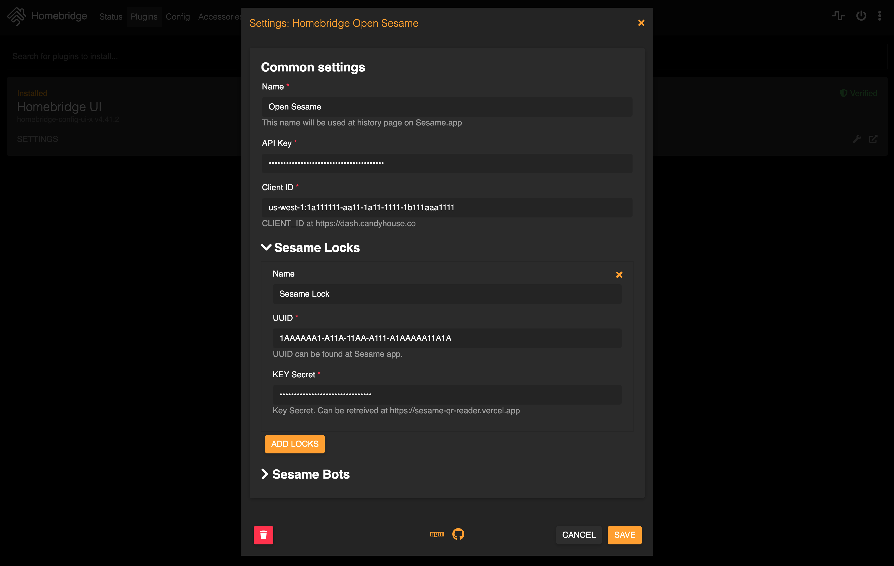

<p align="center">

</p>

<span align="center">

# homebridge-open-sesame

[](https://github.com/yasuoza/homebridge-open-sesame/releases) [](https://www.npmjs.com/package/homebridge-open-sesame)

[](https://github.com/yasuoza/homebridge-open-sesame/actions) [](https://www.npmjs.com/package/homebridge-open-sesame)

[](https://github.com/homebridge/homebridge/wiki/Verified-Plugins)


Homebridge plugin for SESAME3 and SESAME BOT.

</span>

## Features

- Real time status update support(even when manual lock/unlock).
- No status polling(`Limit Exceeded` avoidance)
- SESAME bot support.

## Install

```
npm install -g homebridge-open-sesame
```

## Configuration

### Configure with UI

Configure with [Homebridge Config UI X](https://github.com/oznu/homebridge-config-ui-x#readme) is recommended.



### Configure with config.json

```json
{
  "platforms": [
    {
      "platform": "OpenSesame",
      "name": "Open Sesame",
      "apiKey": "API_KEY from candyhouse developer site",
      "clientID": "CLIENT_ID from candyhouse developer site",
      "locks": [
        {
          "name": "SESAME3 name",
          "uuid": "UUID from Sesame.app",
          "secret": "Key Secret"
        }
      ]
    }
  ]
}
```

## Credits

- Cognito integration code based on [pysesame3](https://github.com/mochipon/pysesame3).
